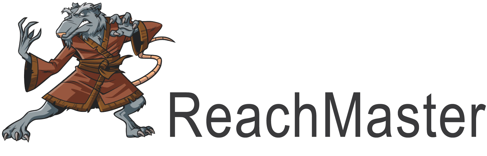

A pneumatically-actuated robotic system for complex rodent reaching tasks, complete with software pipeline capable of extracting single-trial freely-behaving reaching time-series data.

Check out our documentation (we are still in development!!), currently for Bouchard Lab use only:
https://reachmaster.readthedocs.io/en/latest/
